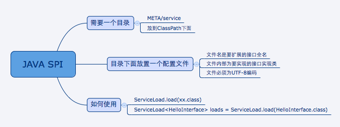
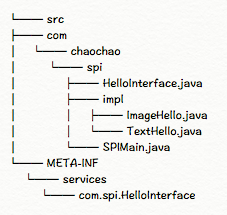

## SPI (Service Provider Interface) ,是JDK内置的一种服务提供发现机制。



目前有不少框架用它来做服务的扩展发现，比如说dubbo。 简单来说，它就是一种动态替换发现的机制， 举个例子来说， 有个接口，想运行时动态的给它添加实现，你只需要添加一个实现,
通过一个简单例子来说明SPI是如何使用的。

而后，把新加的实现，描述给JDK知道就行啦（通过改一个文本文件即可）公司内部，目前Dubbo框架就基于SPI机制提供扩展功能。



我们首先需要一个目录，META-INF\services 如下，最终的目录路径就像这样：

```java
META-INF/service/io.github.iqiancheng.spi.HelloServce
```
文件名字为 接口/抽象类： 全名 文件内容： 接口/抽象类 实现类
就像这样：`io.github.iqiancheng.spi.HelloServce`
```java
public interface HelloService {

    String say(String msg);
}

```
实现类
```java
@Slf4j
public class HelloServiceImpl implements HelloService{

    public String say(String msg) {
        log.debug("HelloServiceImpl.say({}) enter..",msg);
        return msg;
    }
}

```
我们启动起来。
```java
@Slf4j
public class Main {

    public static void main(String[] args) {
        log.info("startup");
        ServiceLoader<HelloService> loaders = ServiceLoader.load(HelloService.class);
        for (HelloService loader : loaders) {
            loader.say("spi");
        }
    }
}
```
程序运行得到结果
```java
[main] INFO io.github.iqiancheng.spi.Main - startup
[main] DEBUG io.github.iqiancheng.spi.service.HelloServiceImpl - HelloServiceImpl.say(spi) enter..
```

源代码：[ServiceLoader.java](doc/serviceloader-source.md)